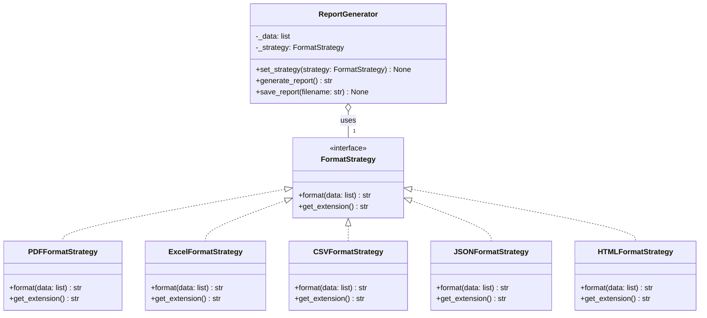

# Strategy Pattern – Multi-format report generator

```mermaid
classDiagram
    class ReportGenerator {
        -_data: list
        -_strategy: FormatStrategy
        +set_strategy(strategy: FormatStrategy) None
        +generate_report() str
        +save_report(filename: str) None
    }

    class FormatStrategy {
        <<interface>>
        +format(data: list) str
        +get_extension() str
    }

    class PDFFormatStrategy {
        +format(data: list) str
        +get_extension() str
    }
    class ExcelFormatStrategy {
        +format(data: list) str
        +get_extension() str
    }
    class CSVFormatStrategy {
        +format(data: list) str
        +get_extension() str
    }
    class JSONFormatStrategy {
        +format(data: list) str
        +get_extension() str
    }
    class HTMLFormatStrategy {
        +format(data: list) str
        +get_extension() str
    }

    ReportGenerator o-- "1" FormatStrategy : uses
    FormatStrategy <|.. PDFFormatStrategy
    FormatStrategy <|.. ExcelFormatStrategy
    FormatStrategy <|.. CSVFormatStrategy
    FormatStrategy <|.. JSONFormatStrategy
    FormatStrategy <|.. HTMLFormatStrategy
```
