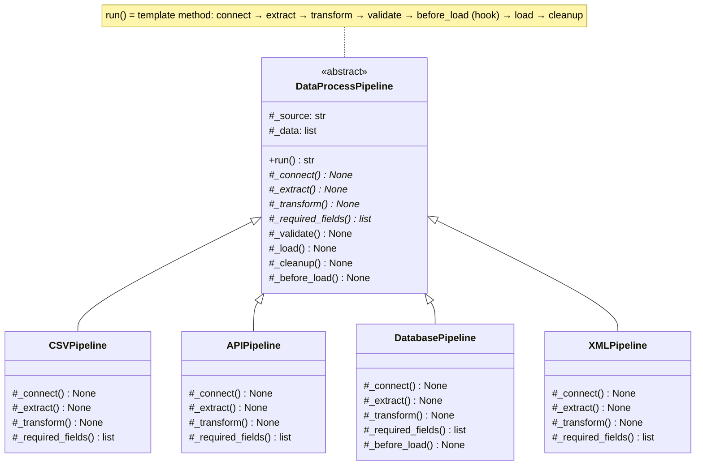

# Template Method Pattern – Data ETL pipelines

```mermaid
classDiagram
    class DataProcessPipeline {
        <<abstract>>
        #_source: str
        #_data: list
        +run() str
        #_connect() None*
        #_extract() None*
        #_transform() None*
        #_required_fields() list*
        #_validate() None
        #_load() None
        #_cleanup() None
        #_before_load() None
    }

    class CSVPipeline {
        #_connect() None
        #_extract() None
        #_transform() None
        #_required_fields() list
    }
    class APIPipeline {
        #_connect() None
        #_extract() None
        #_transform() None
        #_required_fields() list
    }
    class DatabasePipeline {
        #_connect() None
        #_extract() None
        #_transform() None
        #_required_fields() list
        #_before_load() None
    }
    class XMLPipeline {
        #_connect() None
        #_extract() None
        #_transform() None
        #_required_fields() list
    }

    note for DataProcessPipeline "run() = template method: connect → extract → transform → validate → before_load (hook) → load → cleanup"

    DataProcessPipeline <|-- CSVPipeline
    DataProcessPipeline <|-- APIPipeline
    DataProcessPipeline <|-- DatabasePipeline
    DataProcessPipeline <|-- XMLPipeline
```
