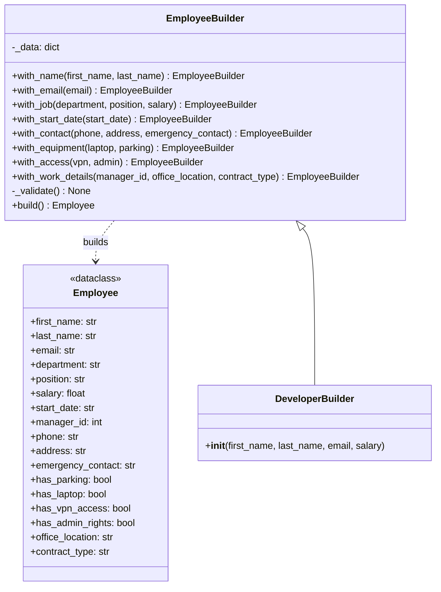

# Builder Pattern – HR Employee Onboarding

```mermaid
classDiagram
    class Employee {
        <<dataclass>>
        +first_name: str
        +last_name: str
        +email: str
        +department: str
        +position: str
        +salary: float
        +start_date: str
        +manager_id: int
        +phone: str
        +address: str
        +emergency_contact: str
        +has_parking: bool
        +has_laptop: bool
        +has_vpn_access: bool
        +has_admin_rights: bool
        +office_location: str
        +contract_type: str
    }

    class EmployeeBuilder {
        -_data: dict
        +with_name(first_name, last_name) EmployeeBuilder
        +with_email(email) EmployeeBuilder
        +with_job(department, position, salary) EmployeeBuilder
        +with_start_date(start_date) EmployeeBuilder
        +with_contact(phone, address, emergency_contact) EmployeeBuilder
        +with_equipment(laptop, parking) EmployeeBuilder
        +with_access(vpn, admin) EmployeeBuilder
        +with_work_details(manager_id, office_location, contract_type) EmployeeBuilder
        -_validate() None
        +build() Employee
    }

    class DeveloperBuilder {
        +__init__(first_name, last_name, email, salary)
    }

    EmployeeBuilder ..> Employee : builds
    EmployeeBuilder <|-- DeveloperBuilder
```