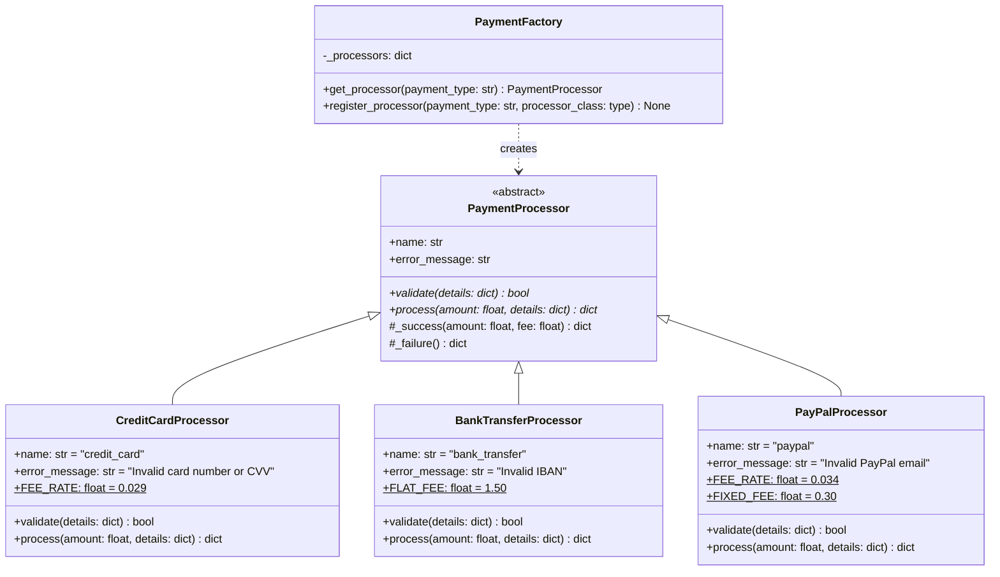

# Factory Pattern – Payment system

```mermaid
classDiagram
    class PaymentFactory {
        -_processors: dict
        +get_processor(payment_type: str) PaymentProcessor
        +register_processor(payment_type: str, processor_class: type) None
    }

    class PaymentProcessor {
        <<abstract>>
        +name: str
        +error_message: str
        +validate(details: dict)* bool
        +process(amount: float, details: dict)* dict
        #_success(amount: float, fee: float) dict
        #_failure() dict
    }

    class CreditCardProcessor {
        +name: str = "credit_card"
        +error_message: str = "Invalid card number or CVV"
        +FEE_RATE: float = 0.029$
        +validate(details: dict) bool
        +process(amount: float, details: dict) dict
    }

    class BankTransferProcessor {
        +name: str = "bank_transfer"
        +error_message: str = "Invalid IBAN"
        +FLAT_FEE: float = 1.50$
        +validate(details: dict) bool
        +process(amount: float, details: dict) dict
    }

    class PayPalProcessor {
        +name: str = "paypal"
        +error_message: str = "Invalid PayPal email"
        +FEE_RATE: float = 0.034$
        +FIXED_FEE: float = 0.30$
        +validate(details: dict) bool
        +process(amount: float, details: dict) dict
    }

    PaymentFactory ..> PaymentProcessor : creates
    PaymentProcessor <|-- CreditCardProcessor
    PaymentProcessor <|-- BankTransferProcessor
    PaymentProcessor <|-- PayPalProcessor
```