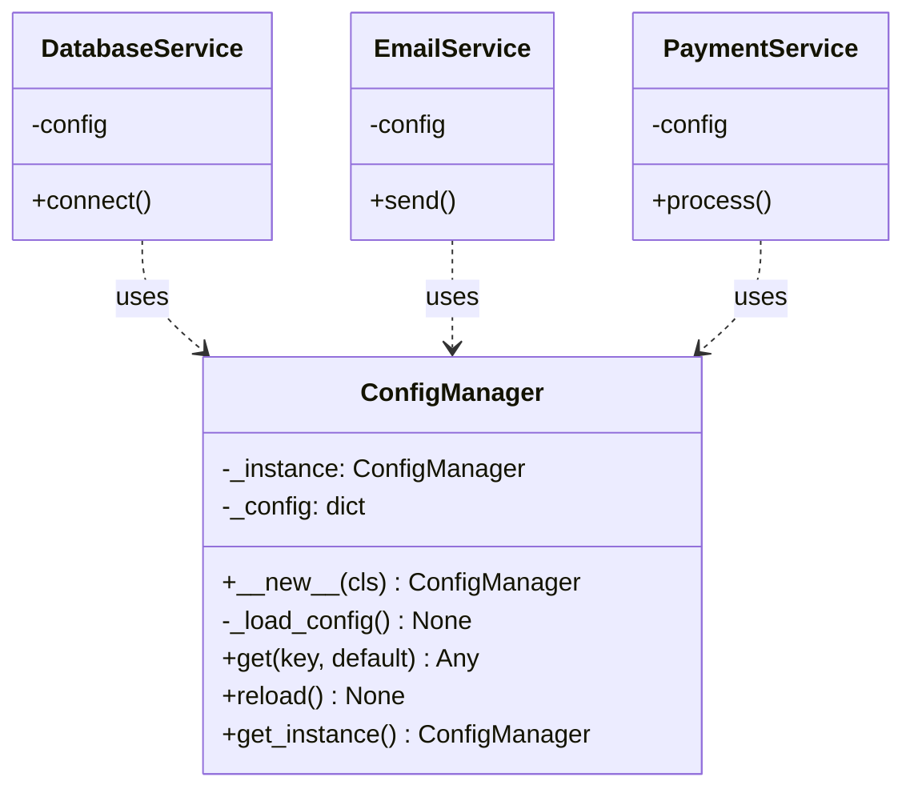

# Singleton Pattern – Configuration manager

```mermaid
classDiagram
    class ConfigManager {
        -_instance: ConfigManager
        -_config: dict
        +#95;#95;new#95;#95;(cls) ConfigManager
        -_load_config() None
        +get(key, default) Any
        +reload() None
        +get_instance() ConfigManager
    }

    class DatabaseService {
        -config
        +connect()
    }
    class EmailService {
        -config
        +send()
    }
    class PaymentService {
        -config
        +process()
    }

    DatabaseService ..> ConfigManager : uses
    EmailService ..> ConfigManager : uses
    PaymentService ..> ConfigManager : uses
```
