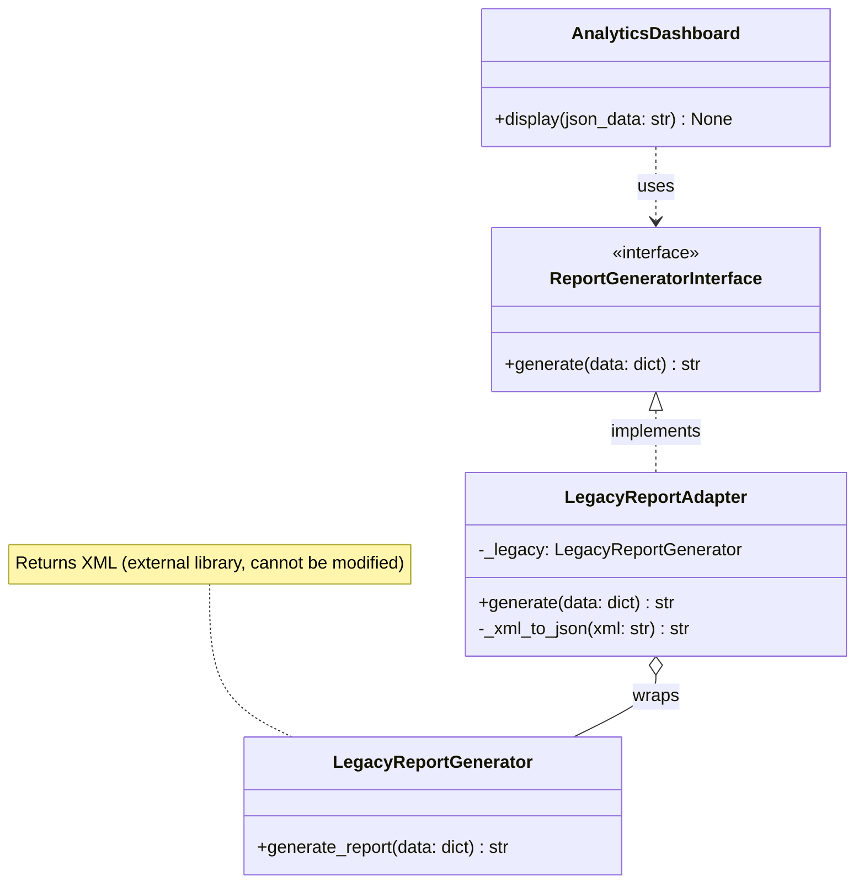

# Adapter Pattern – Reporting system (XML → JSON)

```mermaid
classDiagram
    class AnalyticsDashboard {
        +display(json_data: str) None
    }

    class ReportGeneratorInterface {
        <<interface>>
        +generate(data: dict) str
    }

    class LegacyReportAdapter {
        -_legacy: LegacyReportGenerator
        +generate(data: dict) str
        -_xml_to_json(xml: str) str
    }

    class LegacyReportGenerator {
        +generate_report(data: dict) str
    }
    note for LegacyReportGenerator "Returns XML (external library, cannot be modified)"

    AnalyticsDashboard ..> ReportGeneratorInterface : uses
    ReportGeneratorInterface <|.. LegacyReportAdapter : implements
    LegacyReportAdapter o-- LegacyReportGenerator : wraps
``` 