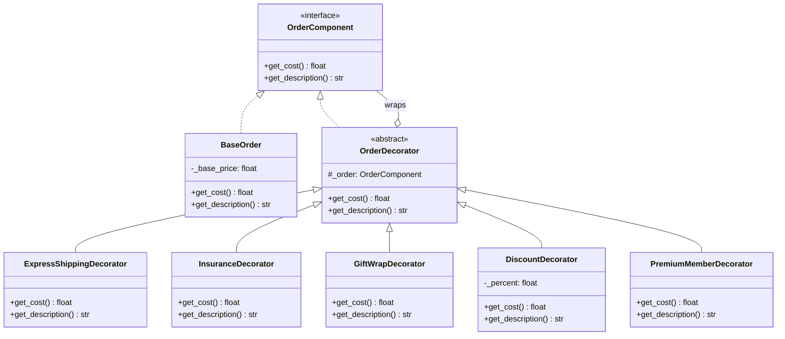

# Decorator Pattern – Order pricing system

```mermaid
classDiagram
    class OrderComponent {
        <<interface>>
        +get_cost() float
        +get_description() str
    }

    class BaseOrder {
        -_base_price: float
        +get_cost() float
        +get_description() str
    }

    class OrderDecorator {
        <<abstract>>
        #_order: OrderComponent
        +get_cost() float
        +get_description() str
    }

    class ExpressShippingDecorator {
        +get_cost() float
        +get_description() str
    }
    class InsuranceDecorator {
        +get_cost() float
        +get_description() str
    }
    class GiftWrapDecorator {
        +get_cost() float
        +get_description() str
    }
    class DiscountDecorator {
        -_percent: float
        +get_cost() float
        +get_description() str
    }
    class PremiumMemberDecorator {
        +get_cost() float
        +get_description() str
    }

    OrderComponent <|.. BaseOrder
    OrderComponent <|.. OrderDecorator
    OrderDecorator o-- OrderComponent : wraps
    OrderDecorator <|-- ExpressShippingDecorator
    OrderDecorator <|-- InsuranceDecorator
    OrderDecorator <|-- GiftWrapDecorator
    OrderDecorator <|-- DiscountDecorator
    OrderDecorator <|-- PremiumMemberDecorator
```

